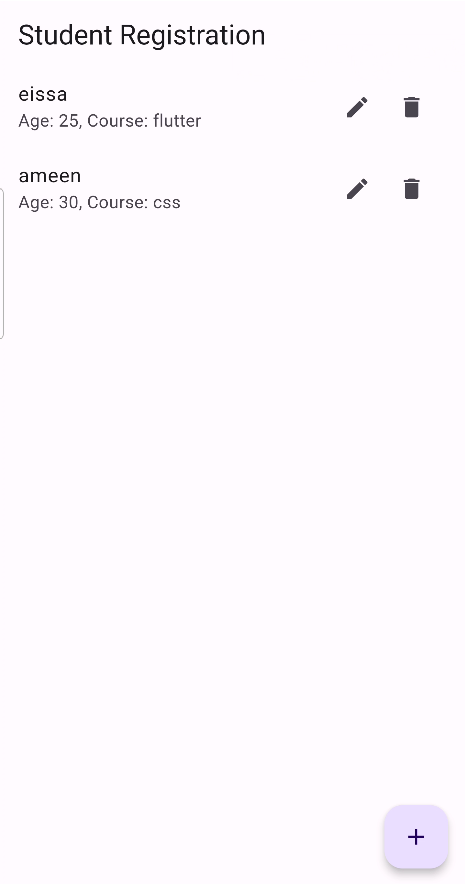
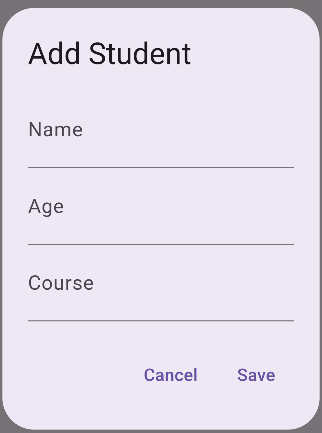
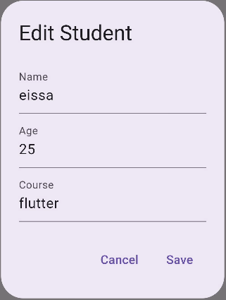

# sqflite_database_use_getx

A new Flutter project.

## Getting Started

This project is a starting point for a Flutter application.

A few resources to get you started if this is your first Flutter project:

- [Lab: Write your first Flutter app](https://docs.flutter.dev/get-started/codelab)
- [Cookbook: Useful Flutter samples](https://docs.flutter.dev/cookbook)

For help getting started with Flutter development, view the
[online documentation](https://docs.flutter.dev/), which offers tutorials,
samples, guidance on mobile development, and a full API reference.

# تطبيق تخزين في قاعدة البيانات إدارة الحالة باستخدام GetX

هذا المشروع هو مثال توضيحي لاستخدام 
 لإدارة الحالةGetX and sqflite لتخزين البيانات داخلياً باستخدام  Flutter. يهدف المشروع إلى توفير 

## صور توضيحية

### الشاشة عرض الطلاب


### شاشة اضافة طالب


### شاشة تعديل طالب


## كيفية استخدام المشروع

### المتطلبات
- Flutter SDK مثبت على جهازك.
- محرر نصوص مثل Visual Studio Code أو Android Studio.

### خطوات التشغيل
1. **نسخ المستودع:**
   ```sh
   git clone https://github.com/YourUsername/YourRepository.git
